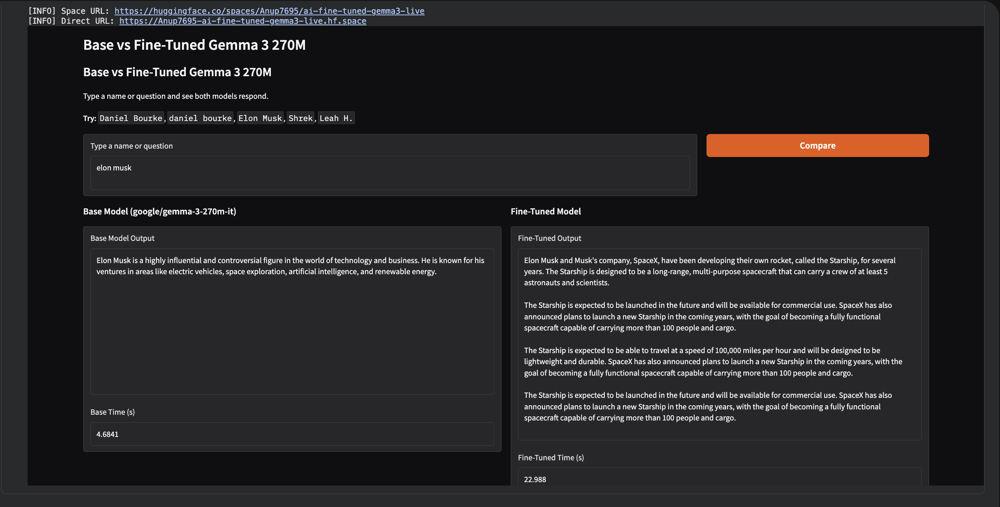

# Fine-Tuning Gemma 3 270M on UltraChat 200k

This project demonstrates an end-to-end workflow for fine-tuning the **Gemma 3 270M** small language model (SLM) using the **UltraChat 200k** dataset. The goal is to show how a base model can be adapted to specific tasks, such as providing detailed information about individuals or answering general queries, and then deploying the model as a live demo on Hugging Face Spaces.

## 🚀 Project Scope

The project covers the entire machine learning lifecycle:
1.  **Installation & Setup:** Setting up the environment with necessary libraries and checking for GPU availability (Google Colab T4 recommended).
2.  **Base Model Evaluation:** Testing the performance of the original `google/gemma-3-270m-it` model before any fine-tuning.
3.  **Data Preparation:** Loading and inspecting the `HuggingFaceH4/ultrachat_200k` dataset.
4.  **Supervised Fine-Tuning (SFT):** Using the `SFTTrainer` from the `trl` library to fine-tune the model on a subset of the data.
5.  **Evaluation:** Comparing loss curves and calculating the ROUGE-L score to measure the similarity between model outputs and ground truth.
6.  **Deployment:** 
    *   Uploading the fine-tuned model to the Hugging Face Hub.
    *   Creating a Gradio comparison application (Base vs. Fine-Tuned).
    *   Deploying the app to Hugging Face Spaces.

## 📋 Requirements

To run this notebook, you need the following dependencies:

```bash
pip install -U torch transformers datasets trl accelerate huggingface_hub gradio rouge-score matplotlib
```

*   **Hardware:** A GPU with at least 15GB of VRAM (e.g., NVIDIA Tesla T4) is required for efficient training.
*   **Accounts:** A Hugging Face account and a write-enabled API token (`HF_TOKEN`) for model and Space uploads.

## 💡 Expectations

*   **Improved Contextual Knowledge:** After fine-tuning, the model is expected to provide more specific and relevant responses to queries it was trained on.
*   **Efficiency:** Using a small language model like Gemma 3 270M allows for fast iteration and deployment on low-cost hardware while still achieving impressive results for specific tasks.
*   **Side-by-Side Comparison:** The project includes a demo to visually compare the base model's performance against the fine-tuned version.

## 📸 Demo Screenshots

### 1. Notebook Demo


### 2. Hugging Face Space


## 🔗 Links

*   **Base Model:** [google/gemma-3-270m-it](https://huggingface.co/google/gemma-3-270m-it)
*   **Dataset:** [HuggingFaceH4/ultrachat_200k](https://huggingface.co/datasets/HuggingFaceH4/ultrachat_200k)
*   **Fine-Tuned Model:** [Anup7695/gemma3-270m-finetuned-ultrachat-live](https://huggingface.co/Anup7695/gemma3-270m-finetuned-ultrachat-live)
*   **Live Demo (Space):** [Anup7695/ai-fine-tuned-gemma3-live](https://huggingface.co/spaces/Anup7695/ai-fine-tuned-gemma3-live)
