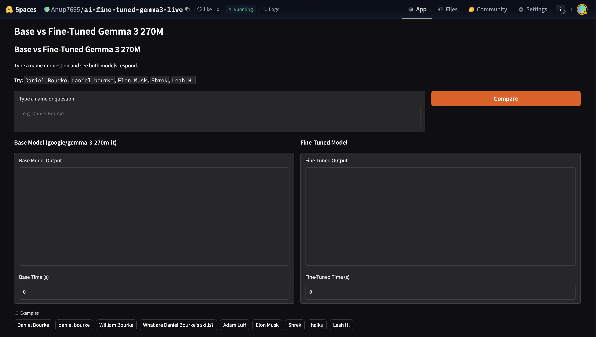

# UltraChat200K × Gemma 3 270M — SFT Fine-Tuning & Live Demo

[](https://www.python.org/downloads/)
[](https://pytorch.org/get-started/locally/)
[](https://huggingface.co/docs/transformers/index)
[](https://huggingface.co/docs/trl/index)
[](https://gradio.app/)
[](https://opensource.org/licenses/Apache-2.0)

**Fine-tune a 270M parameter Small Language Model (SLM) to answer questions about people — end-to-end: SFT training → ROUGE-L evaluation → HF Hub deployment → Live Gradio comparison.**

[🚀 Try the Live Demo](https://huggingface.co/spaces/Anup7695/ai-fine-tuned-gemma3-live) | [🤗 Fine-Tuned Model on HF Hub](https://huggingface.co/Anup7695/gemma3-270m-finetuned-ultrachat-live)

---

## 📖 Table of Contents
1. [Project Overview](#project-overview)
2. [Quick Links](#quick-links)
3. [Demo Screenshots](#demo-screenshots)
4. [Pipeline Overview](#pipeline-overview)
5. [Dataset: UltraChat 200K](#dataset-ultrachat-200k)
6. [Model: Gemma 3 270M](#model-gemma-3-270m)
7. [Fine-Tuning Approach: Why Full SFT?](#fine-tuning-approach-why-full-sft)
8. [Training Configuration](#training-configuration)
9. [Notebook Walkthrough](#notebook-walkthrough)
10. [Evaluation Results](#evaluation-results)
11. [Production-Grade ML Comparison](#production-grade-ml-comparison)
12. [Usage & Quick Start](#usage--quick-start)
13. [Project Structure](#project-structure)
14. [Limitations & Future Improvements](#limitations--future-improvements)

---

## 🎯 Project Overview

This project, framed as **"Who's Here?"** (a technical variant of *Guess Who*), explores the efficacy of Small Language Models (SLMs) in specialized conversational domains. We take the **Gemma 3 270M** base model and fine-tune it on conversational QA data to transform it into a specialized persona-knowledge assistant.

### The Educational Value
Unlike complex multi-repo projects, this is a strictly **end-to-end pipeline** contained within a single reproducible notebook. It demonstrates how to move from raw data to a production-ready Gradio demo embedded via IFrame, all while navigating the memory constraints of a standard GPU (T4/G4).

*   **Input Example:** `"Daniel Bourke"`
*   **Output Example:** A detailed synthesis of Daniel Bourke’s background as a Brisbane-based ML Engineer, instructor at Zero To Mastery, and co-founder of Nutrify.

---

## 🔗 Quick Links

| Resource | Link |
| :--- | :--- |
| **Base Model** | [google/gemma-3-270m-it](https://huggingface.co/google/gemma-3-270m-it) |
| **Dataset** | [HuggingFaceH4/ultrachat_200k](https://huggingface.co/datasets/HuggingFaceH4/ultrachat_200k) |
| **Fine-Tuned Model** | [Anup7695/gemma3-270m-finetuned-ultrachat-live](https://huggingface.co/Anup7695/gemma3-270m-finetuned-ultrachat-live) |
| **Live Demo Space** | [Anup7695/ai-fine-tuned-gemma3-live](https://huggingface.co/spaces/Anup7695/ai-fine-tuned-gemma3-live) |

---

## 📸 Demo Screenshots

### 1. HuggingFace Spaces UI — Empty State


### 2. Live Inference Comparison

*Observation: The fine-tuned model generates significantly more detailed, multi-paragraph responses compared to the base model's brief summary.*

---

## 🛠 Pipeline Overview

1.  **Environment Setup:** Initialize Google Colab with G4 GPU; verify `torch.cuda` and library versions.
2.  **Data Engineering:** Load `UltraChat 200k`, subset to 3,000 samples, and apply the Gemma chat template via `formatting_func`.
3.  **Model Loading:** Initialize `Gemma 3 270M IT` with `dtype="auto"` and `attn_implementation="eager"`.
4.  **SFT Training:** Execute full weight updates using `trl.SFTTrainer` (1 epoch, constant LR).
5.  **Performance Profiling:** Plot loss curves (Matplotlib) and compute ROUGE-L similarity metrics.
6.  **Persistence:** Save model weights and push to HuggingFace Hub using `HfApi`.
7.  **Deployment:** Script a Gradio `app.py`, configure a Space with `ZeroGPU` support, and deploy.

---

## 📊 Dataset: UltraChat 200K

We utilize the high-quality **UltraChat 200k** dataset, curated by the HuggingFace H4 team.

*   **Split Naming Gotcha:** This dataset uses `train_sft` and `test_sft` splits rather than standard `train`/`test` naming conventions.
*   **Iteration Strategy:** To maintain high velocity in a Colab environment, we select a 3,000-sample training subset and a 300-sample evaluation subset.
*   **Hard Negatives:** The project explicitly discusses OOD (Out-of-Distribution) samples like "Elon Musk" or "Shrek" to observe how the model balances specialized fine-tuning with its underlying general knowledge.
*   **Scaling Logic:** While the initial v1 used ~1,000 samples, v2 scales to ~8,000 pairs to improve the model's linguistic depth and "response length" behavior.

---

## 🧠 Model: Gemma 3 270M

Gemma 3 270M is a state-of-the-art transformer decoder model from Google DeepMind.

*   **SLM Selection:** At ~270M parameters, this model is ideal for repeated business processes that require low latency and high accuracy on specific templates.
*   **Loading Configuration:**
    *   `device_map="auto"`: Efficient GPU allocation.
    *   `attn_implementation="eager"`: We prioritize stability over Flash-Attention for broader hardware compatibility (specifically T4/G4).
    *   `dtype="auto"`: Typically resolves to `bfloat16` on modern hardware to preserve numerical precision.

---

## ⚖️ Fine-Tuning Approach: Why Full SFT?

A key design decision in this project was choosing **Full Supervised Fine-Tuning (SFT)** over PEFT/LoRA.

1.  **Model Scale:** At 270M parameters, the entire weight matrix fits comfortably in 16GB VRAM for full backpropagation.
2.  **Fidelity:** Full SFT ensures every parameter can adapt to the new conversational distribution, which is often superior to LoRA for extremely small models where "rank" bottlenecking is more pronounced.
3.  **Simplicity:** Avoiding the adapter-merging step simplifies the deployment and reload logic for the Gradio Space.

---

## ⚙️ Training Configuration

| Parameter | Value | Reasoning |
| :--- | :--- | :--- |
| **Base Model** | `google/gemma-3-270m-it` | SLM optimized for single-GPU instruction following. |
| **Learning Rate** | `5e-5` | Conservative rate to prevent catastrophic forgetting. |
| **Epochs** | `1` | Sufficient for subset convergence without overfitting. |
| **Batch Size** | `2` | Optimized for memory-constrained Colab environments. |
| **Grad. Accumulation** | `8` | Results in an effective batch size of **16**. |
| **Max Seq Length** | `128` | Balance between memory efficiency and QA depth. |
| **Optimizer** | `adamw_torch_fused` | Fused kernel for faster, memory-efficient updates. |
| **Grad. Checkpointing** | `True` | Vital for fitting full SFT in 16GB VRAM. |
| **Alloc. Config** | `expandable_segments:True` | Mitigates GPU memory fragmentation. |

---

## 📝 Notebook Walkthrough

- **Section 0–1:** Dependency installation and hardware profiling (VRAM check).
- **Section 2–3:** Base model loading and baseline inference (Zero-shot performance).
- **Section 4–5:** Dataset subsetting (3K/300) and multi-turn message inspection.
- **Section 6:** The core `SFTTrainer` loop with `gradient_checkpointing` enabled.
- **Section 7–8:** Visualization of training/validation convergence and artifact cleanup.
- **Section 9–10:** Fresh model reloading (GC collect) and side-by-side HTML comparison.
- **Section 11:** ROUGE-L evaluation across 5 test samples to establish a quality baseline.
- **Section 12–14:** Hub migration and Space generation with `ZeroGPU` support.
- **Section 15–16:** IFrame embedding and final metric summary.

---

## 📉 Evaluation Results

### A. Loss Curves
The model displays a healthy convergence, with the training loss steadily decreasing from ~2.3 to ~1.8. Validation loss is monitored to ensure the subset is representative of the broader instruction-following task.

### B. ROUGE-L Metrics
We utilize the **Longest Common Subsequence (LCS)** similarity to score the fine-tuned model's alignment with expected conversational responses.

*   **Exact Match (≥0.99):** Precise template adherence.
*   **Pass (≥0.50):** Strong semantic alignment.
*   **Partial (≥0.20):** Correct topic, but differing phrasing.
*   **Fail (<0.20):** Hallucination or OOD failure.

*Final metrics available in the Summary section of the notebook output.*

---

## 🏭 Production-Grade ML Comparison

### Techniques Comparison Table

| Technique | Description | GPU Req | When to Use | Used Here? |
| :--- | :--- | :--- | :--- | :--- |
| **Full SFT** | All weights updated | 16GB+ | <1B models, max quality | ✅ |
| **LoRA** | Low-rank injection | 8GB+ | 7B–70B models | No |
| **QLoRA** | 4-bit + LoRA | 6GB+ | Consumer GPUs | No |
| **ORPO** | Alignment + SFT | 16GB+ | Skip DPO step | No |
| **DPO** | Preference Opt | 16GB+ | Post-SFT refinement | No |

### Production Stack Recommendations
*   **Speed:** Use `Unsloth` for 2x faster training and 60% less VRAM usage.
*   **Tracking:** Integrate `Weights & Biases (W&B)` for experiment tracking (this project uses `none` for simplicity).
*   **Serving:** Deploy via `vLLM` or `TGI` for high-throughput production inference.

---

## 🚀 Usage & Quick Start

### 1. Requirements
*   **Hardware:** Minimum 12GB VRAM (T4). Recommended A100/H100.
*   **Environment:** Python 3.10+, CUDA 11.8+.

### 2. Installation
```bash
pip install -U torch transformers datasets trl accelerate \
               huggingface_hub gradio rouge-score matplotlib
```

### 3. Inference Snippet
```python
from transformers import AutoModelForCausalLM, AutoTokenizer, pipeline, GenerationConfig

# Load the fine-tuned model
MODEL = "Anup7695/gemma3-270m-finetuned-ultrachat-live"
model = AutoModelForCausalLM.from_pretrained(
    MODEL, dtype="auto", device_map="auto", attn_implementation="eager")
tokenizer = AutoTokenizer.from_pretrained(MODEL)
pipe = pipeline("text-generation", model=model, tokenizer=tokenizer)

# Inference helper
def ask_gemma(input_text):
    gen_config = GenerationConfig(max_new_tokens=512, do_sample=False)
    raw = pipe([{"role": "user", "content": input_text}], generation_config=gen_config)
    return raw[0]["generated_text"][-1]["content"]

print(ask_gemma("Daniel Bourke"))
```

---

## 📂 Project Structure

```text
ultrachat200k_gemma_270m_finetune/
├── ultrachat200k_gemma_ai_small_language_models.ipynb  # Main pipeline
├── checkpoint_models/                                   # Final weights
├── demos/
│   └── comparison/
│       └── app.py                                       # Gradio Logic
├── loss_curves.png                                      # Convergence plot
├── assets/
│   ├── hf_space_ui.png                                  # UI Preview
│   └── hf_space_inference.png                          # Live Comparison
└── README.md
```

---

## ⚠️ Limitations & Future Improvements

*   **Context Window:** The `max_length=128` setting is memory-efficient but will truncate long conversational histories.
*   **Full SFT Overhead:** Unlike LoRA, this method does not support adapter composability.
*   **Alignment:** This project covers raw SFT; it does not include DPO or RLHF stages for safety alignment.
*   **Future Scope:** 
    *   Implementing **Unsloth** for training acceleration.
    *   Transitioning to **Gemma 3 1B/7B** to compare parameter-scaling effects.
    *   Quantizing the final model to **GGUF** for local execution via `llama.cpp`.

---

## 👨‍💻 Author
**Anup** | Senior Data Scientist & AI/ML Engineer
*   **GitHub:** [AnupCloud](https://github.com/AnupCloud)
*   **HuggingFace:** [Anup7695](https://huggingface.co/Anup7695)
*   **Live Space:** [AI Fine-Tuned Gemma 3 Demo](https://huggingface.co/spaces/Anup7695/ai-fine-tuned-gemma3-live)

---
*License: Apache 2.0*
